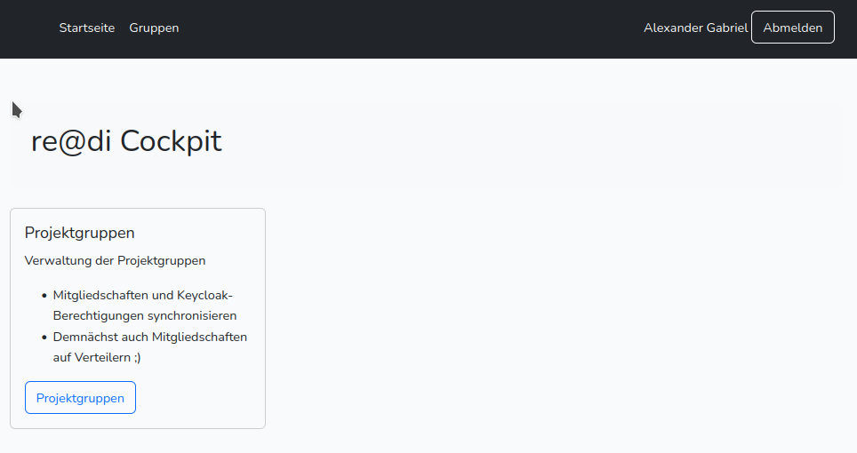
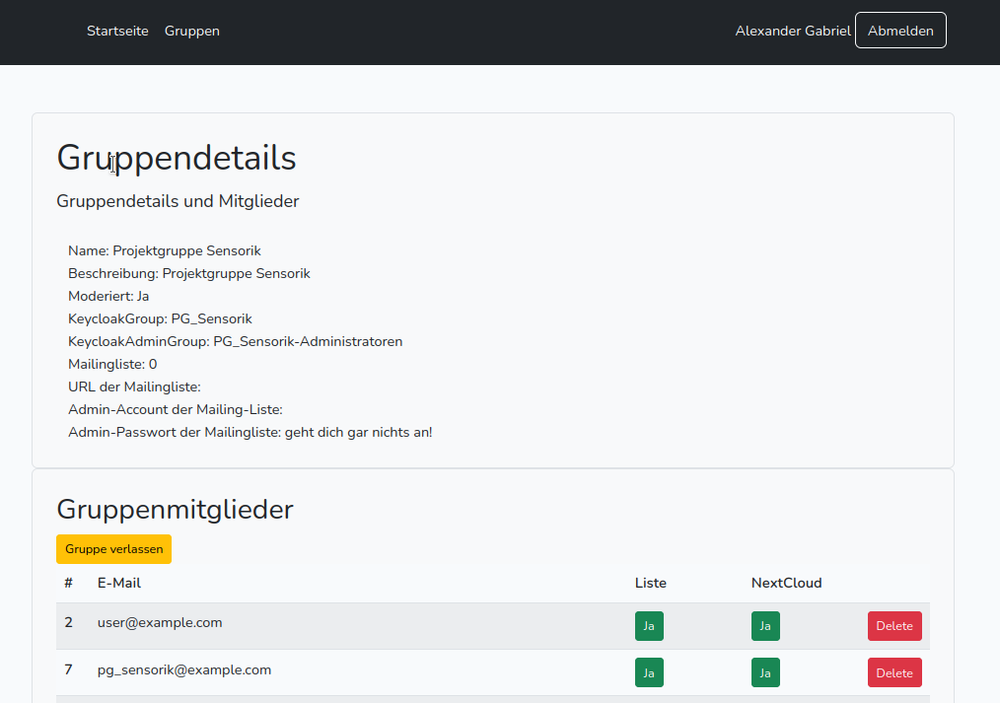
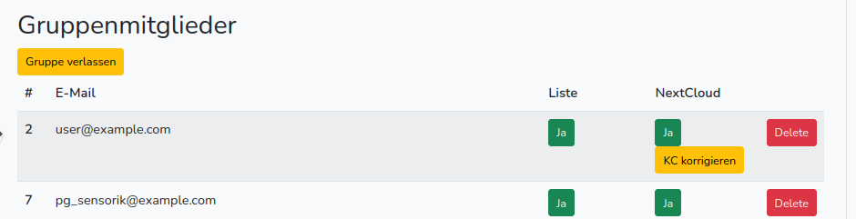

# re@di Cockpit

## About Cockpit

re@di cockpit is built to move some administrative tasks away from the tech-team to more self-service.
This includes adding new project groups and moving users into them.
Final version should manage membership in keycloak an mailman and maybe help keeping data clean

## Images

### Startpage

### Group index

### Show group

### Update Keycloak groupmembership

## ToDo
- Add Button to send Mail to all Members
- Improve Emails...
- Automatic-Mode for Gruops (automatically add new members to Keycloak and Mailman)
- Data-Cleanup Module (list all addresses/make it possible for responsibles to find outdated addresses and remove them from all systems)
